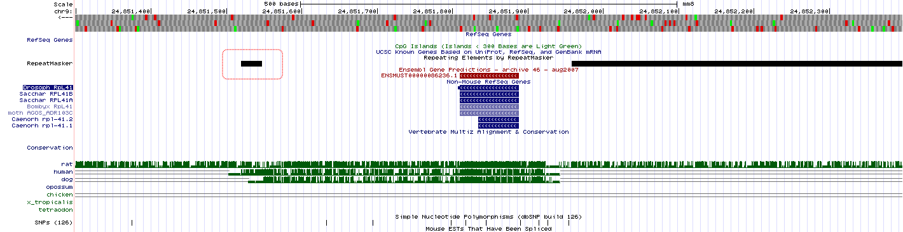
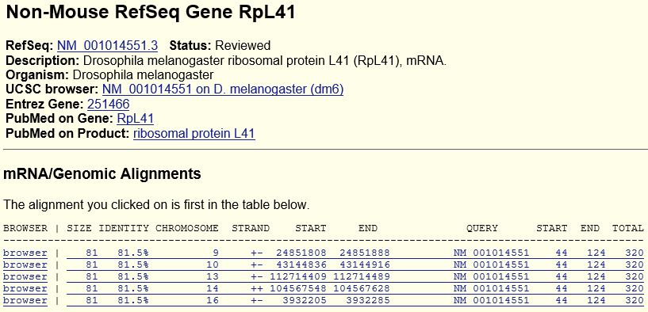
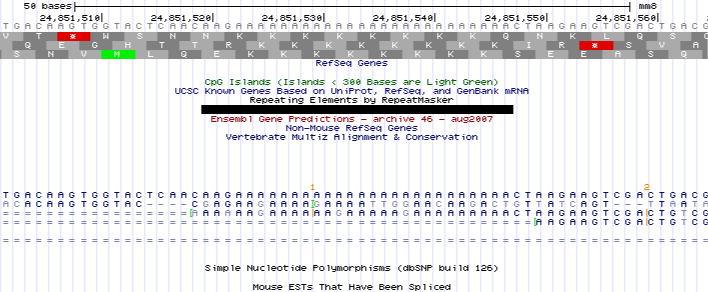
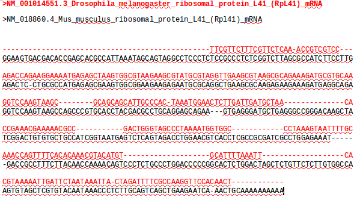

# Part I:  Dicer dissected

The human DICER1 gene encodes an important ribonuclease, involved in miRNA and siRNA processing. Several mRNAs representing this gene have been mapped to the human genome (March 2006 assembly). We will look closer at one of them with the accession number AK002007.

## a) What are the first five genomic nucleotides from the first exon of this transcript?

5'-AAAGG-3'

## b) Look at the raw mRNA sequence of AK002007, from the database it actually comes from. What are the first five nucleotides? 

5'-GAAGC-3'

## c) How do you explain the discrepancy (maximum 5 lines)? 

The end of the cDNA often contain errors which could be due to artifacts or truncated cDNA. When mapping this to the annotated genes, the algorithm that maps the raw sequence to the genome has trouble with these discrepancies. Looking at the exon prior to the transcription start site of AK002007, some the discrepancy sequence actually corresponds to the last part of that exon. This indicates that the cDNA might be truncated.

\newpage{}

# Part II:  ERA and ERB
Our collaborators designed a ChIP study using so-called tilling arrays: one for estrogen receptor alpha (ERA), one for estrogen receptor beta (ERB). All the sites are stored in BED files respectively for two ERs. These are now available in the homework directory, and are both mapped on hg18 genome. 

## a) What is the genome coverage (% of base pair covered at each chromosome) for ERB and ERA sites? Plot the fractions for all chromosomes as a single barplot in R. Briefly comment the results. Is there anything particularly surprising? Try to explain the outcome (biological and/or experimental setup explanations)?

```{r, engine='bash', eval = F}
# Connect to ricco-server
ssh xxx@ricco.popgen.dk

# First we want to make sure that ERA and ERB bedfiles are sorted
sort -k1,1V -k2,2n ERa_hg18.bed > ERa_hg18_sorted.bed
sort -k1,1V -k2,2n ERb_hg18.bed > ERb_hg18_sorted.bed

# And also that the hg18_chrom_sizes.txt are correctly sorted
sort -k1,1V hg18_chrom_sizes.txt > hg18_chrom_sizes_sorted.txt

# Getting the genome-coverages for each
nice bedtools genomecov -i ERa_hg18_sorted.bed -g hg18_chrom_sizes_sorted.txt -max 1 > 
genomecov_ERa.txt
nice bedtools genomecov -i ERb_hg18_sorted.bed -g hg18_chrom_sizes_sorted.txt -max 1 > 
genomecov_ERb.txt
```

Then we read the `genomecov` outputs into R

```{r, message = F}
# Load packages
library(tidyverse)
library(magrittr)
library(gridExtra)

# Import genome coverage data
genomecov_ERa <- read_tsv(file = "genomecov_ERa.txt", col_names = F)
genomecov_ERb <- read_tsv(file = "genomecov_ERb.txt", col_names = F)

# Assign factor levels for chromosomes in the correct order
chr_order <- genomecov_ERa$X1 %>% unique() %>% gtools::mixedsort()
genomecov_ERa$X1 <- genomecov_ERa$X1 %>% factor(levels = chr_order) 
genomecov_ERb$X1 <- genomecov_ERb$X1 %>% factor(levels = chr_order)  

# Create plot 1
p1 <- genomecov_ERa %>% 
  subset(X2 == 0) %>%
  ggplot(aes(x = X1, y = 1-X5)) +
  geom_bar(stat = "identity", color = "black", fill = "grey") +
  ylim(0, 4.5e-4) +
  theme(axis.text.x = element_text(angle = 45, hjust = 1)) +
  labs(x = NULL, y = NULL, 
       title = "Genome coverage by ERa")

# Create plot 2
p2 <- genomecov_ERb %>% 
  subset(X2 == 0) %>%
  ggplot(aes(x = X1, y = 1-X5)) +
  geom_bar(stat = "identity", color = "black", fill = "grey") +
  ylim(0, 4.5e-4) +
  theme(axis.text.x = element_text(angle = 45, hjust = 1)) +
  labs(x = "Chromosome", y = NULL, 
       title = "Genome coverage by ERb")

# Puts the two plots on top of another
grid.arrange(p1, p2, left = "Genome coverage")
```

From the plot it can be seen that ERa and ERb-binding are positively correlated, albeit ERa-binding is more enriched on the chromosomes included. If one can determine that the antibodies used to pulldown are specific to either isoform, this could suggest that ERa and ERb have similar biological binding profiles.

It's worth noting that there is absolutely no signal from several chromosomes, and that the same chromosomes missing in both experiments. Assuming this is raw-data without any threshold to compensate for noise, this suggests that something went wrong experimentally, or that there isn't any probes directed at these chromosomes.

## b) Again, using BEDtools in Linux:  How many ERA sites do/do not overlap ERB sites, and vice versa? Show the Linux commands and then a Venn diagram summarizing the results.  The Venn diagram can be made in R using the Venn package, but you can also make it in any drawing program. 

```{r, engine='bash', eval = F}
bedtools intersect -a ERa_hg18_sorted.bed -b ERb_hg18_sorted.bed -wa | wc -l
345

bedtools intersect -a ERa_hg18_sorted.bed -b ERb_hg18_sorted.bed -v | wc -l
236

bedtools intersect -a ERb_hg18_sorted.bed -b ERa_hg18_sorted.bed  -wa | wc -l
345

bedtools intersect -a ERb_hg18_sorted.bed -b ERa_hg18_sorted.bed  -v | wc -l
140
```

And using R we can create a Venn-diagram.

```{r, message = F, fig.asp= 0.4, fig.align="center"}

# Load the eulerr package for making venn-diagrams
library(eulerr)

fit <- euler(c(ERa = 236, ERb = 140, "ERa&ERb" = 345))

# Plot the diagram
plot(fit, fill_opacity = 0.3, counts = T, 
     key = list(space = "right"),
     main = "Venn diagram"
     )

```

\newpage{}

# Part III:  Ribosomal Gene (*)
Your group just got this email from a frustrated fellow student:

My supervisor has found something he thinks is a new ribosomal protein gene in mouse - it is at chr9:24,851,809-24,851,889, assembly mm8. His arguments for this are
  
  a) It has high conservation in other species because ribosomal protein genes from other species map to this mouse region.
  b) And they are all called Rpl41 in the other species (if you turn on the Other Refseq you see this clearly in fly and other species).
 
But, I found out that if you take the fly mRNA sequence mentioned above (from Genbank) and BLAT this to the fly genome, you actually get something that looks quite different from the one in the mouse genome. 

## How can this be? Is the mouse gene likely to be real? If not, why? (Maximum 20 lines, plus possibly genome browser pictures) 

**Answer:**

The argument of the supervisor is sound, but there are a lot of things that he has not considered;

Zooming a bit out from the mentioned area, the conserved area can be readily seen on the conservation track as seen in figure \ref{fig:1}. From this figure, we can also see that it is only a minor part of the conserved region where ribosomal genes from other species map.

1) The conserved region only has 81,5% identity with the fly rpL41 gene over the 81 bp which isn’t
very impressive.

2) The gene region thought to be a ribosomal protein is very short – only 81 bp. If we compare this to
the drosophila melanogaster rpL41, this has an mRNA length of 320 bp (4x longer than the aligned
area). This can be seen in figure \ref{fig:2}.
 
3) The fly rpL41 gene aligns to 4 other regions in the mouse genome besides the one in question, all
having a length of 81 bp, covering the same part of the fly rpL41 gene with an 81,5% identity, also seen in figure \ref{fig:2}.

Considering the three points, it is most likely that the mouse sequence is not a gene – or at least not a
functional gene. The identity with 5 different regions of the mouse genome hints that the region might be a
transposed element, perhaps originating from the fly rpL41 gene.

Confirming this theory, one can find; a repetitive region downstream from the suspected gene (this is marked by a red-square in figure \ref{fig:1}). Zooming in on this area (figure \ref{fig:3}) reveals that the repetitive element is a series of successive a-nucleotides, which indicates that this is a retrotransposed pseudogene and therefore not a novel ribosomal protein gene.

4) If we do a BLAT search in the mouse genome (mmg8) with the fly rpL41 mRNA (NM_001014551.3), only 4
hits come up, all with identity over ~20 nucleotides.

The differences between the drosophila melanogaster rpL41 gene and the mouse can be visualized doing an alignment between the two genes, shown in figure \ref{fig:4}. We see that there is large discrepancy between the two genes on a nucleotide level, however the two genes may still have a similar protein translation, leading to structural and functional identity.

In conclusion, what the supervisor has found is unlikely to be a gene, if anything; it is potentially a vector transposed to a gene.

```{r, fig.cap = "Suspected novel ribosomal protein gene\\label{fig:1}", echo = FALSE}

```

```{r, fig.cap = "Repetitive element \\label{fig:2}", echo=FALSE}

```

```{r, fig.cap = "Genomic Alignments \\label{fig:3}", echo=FALSE}

```

```{r, fig.cap = "Aignment between drosophila melanogaster and mouse rpL41  \\label{fig:4}", echo=FALSE}

```